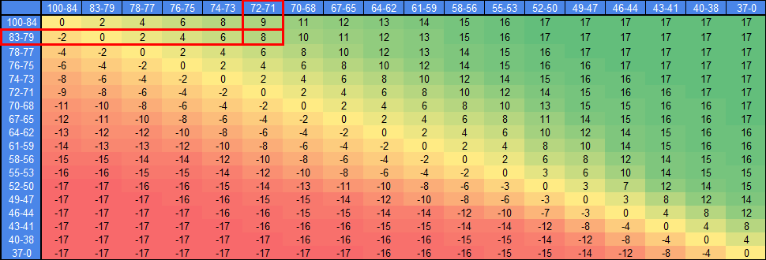
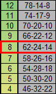
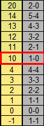

# Simulador de Fútbol

Aplicación desarrollada con **Angular** (frontend) y **Spring Boot** (backend) que permite simular partidos de fútbol, incluyendo tiempo reglamentario, penales, tarjetas rojas y selección de equipos.

## 🚀 Características

- Selección de equipos por liga o confederación.
- Simulación con diferentes duraciones (instantáneo, 30s, 1min, etc.).
- Logeo de incidencias: goles, penales, tarjetas rojas.
- Definición por penales con registro detallado.
- Interfaz adaptada para **desktop** y **mobile**.
- Resultados generados con un modelo probabilístico realista, donde las probabilidades de ganar o perder de cada equipo dependerán de su prestigio actual.

## 🛠️ Tecnologías utilizadas

**Frontend:**
- Angular
- HTML5 / CSS3 / TypeScript

**Backend:**
- Java
- Spring Boot
- Maven

## ⚽ Ligas Disponibles

- Todas las selecciones afiliadas a la FIFA
- Argentina (Primera División, Primera Nacional, Federal A, Primera B y Primera C)
- Alemania
- España (A y B)
- Inglaterra (A y B)
- Italia (A y B)
- Francia
- Portugal
- Países Bajos
- Bolivia
- Brasil (A y B)
- Chile
- Colombia
- Ecuador
- Paraguay
- Perú
- Uruguay
- Venezuela
- Estados Unidos
- México
- Resto de Europa
- Asia, África y Oceanía

## ⚽ Equipos Con Jugadores (provisorio)

- Selección Argentina
- River
- Boca
- Independiente
- Racing
- San Lorenzo
- Vélez
- Estudiantes
- Newell's
- Rosario Central
- Huracán
- Inter Miami
- Real Madrid
- Barcelona
- Chelsea
- PSG
- PES United

## ⚽ Funcionamiento del Algoritmo

- Todos los equipos del juego cuentan con un score del 1 al 100.
- Todos los partidos constarán de un Equipo 1 y un Equipo 2.
- Tomaremos el siguiente partido como ejemplo: Uruguay (score 79) vs. Nigeria (score 72).
- Lo primero que hará el juego es ubicar ambos scores en la matriz de vectores de probabilidad (Equipo 1 en las filas, Equipo 2 en las columnas).
- En nuestro ejemplo, el vector elegido será el código 8:

- Buscamos el vector con el código 8 en el listado de vectores, el mismo contemplará contemplará un 62% de probabilidades de que gane Uruguay (equipo 1), 24% de que empaten y 14% de que gane Nigeria (equipo 2).

- Fíjese que, cuanto más alto es el número, mayor será la probabilidad de que gane el equipo 1
- El mismo vector pero en negativo contemplatá las mismas probabilidades pero a la inversa. Osea que si Nigeria fuera el equipo 1 y Uruguay el equipo 2, el vector elegido será -8 (14-24-62 serían las probabilidades).
- Luego, el juego sorteará un número entero del 1 al 100, y se podrán dar 3 posibilidades: si sale un valor del 1 al 62, ganará Uruguay (62%), del 63 al 86 empatarán (24%), y del 87 al 100 ganará Nigeria (14%.)
- ¿Cómo se sabrá el resultado exacto con goles? De la siguiente manera: supongamos que sale sorteado el número 53 (ganará Uruguay), el resultado elegido tendrá el código 10.

- Buscamos el resultado con el código 10 en el listado de resultados:

- Y finalmente, ya fue determinado de manera exacta el resultado de Uruguay vs. Nigeria, arrojando una victoria por 1 a 0 del conjunto rioplatense.